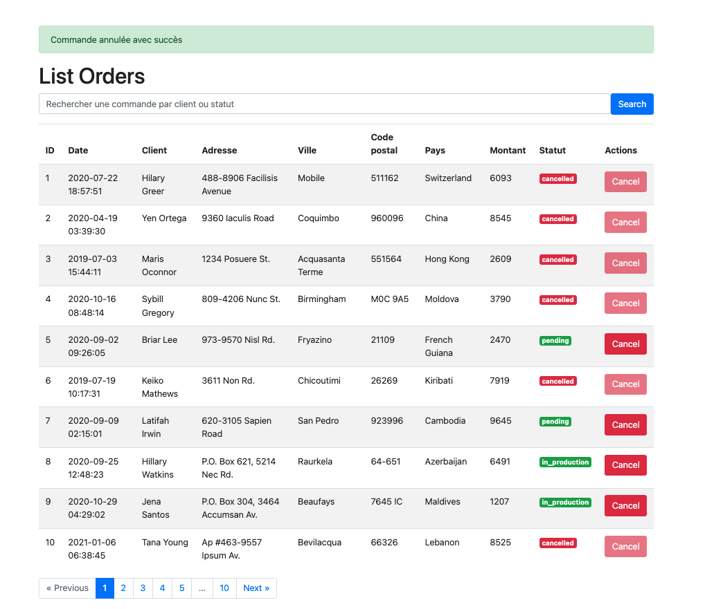

# UpWork Task

## DEscription 
Create a small Symfony 4 + Angular app for orders management (using data from orders.json)

## Requirements
- Create a command to import the data from orders.json in database (use Doctine ORM)
- Show orders in a table
- Add pagination (10 orders/page)
- Allow users to cancel an order (persist the change in db)
- Allow users to search for orders by customer or status

## Important!
Experience with Domain Driven Design (DDD) architecture is a must.
Make sure you will use it to structure your code from the test project.

## Result

